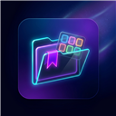
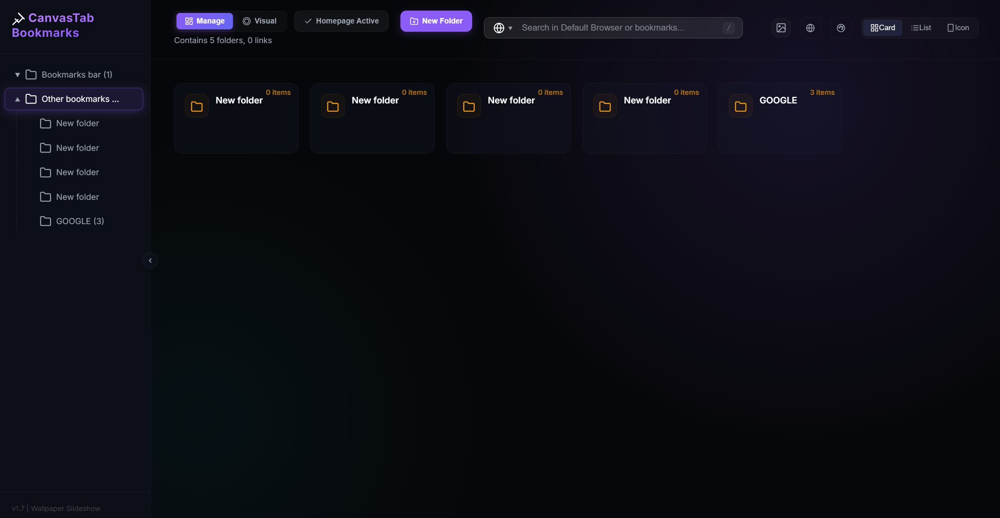
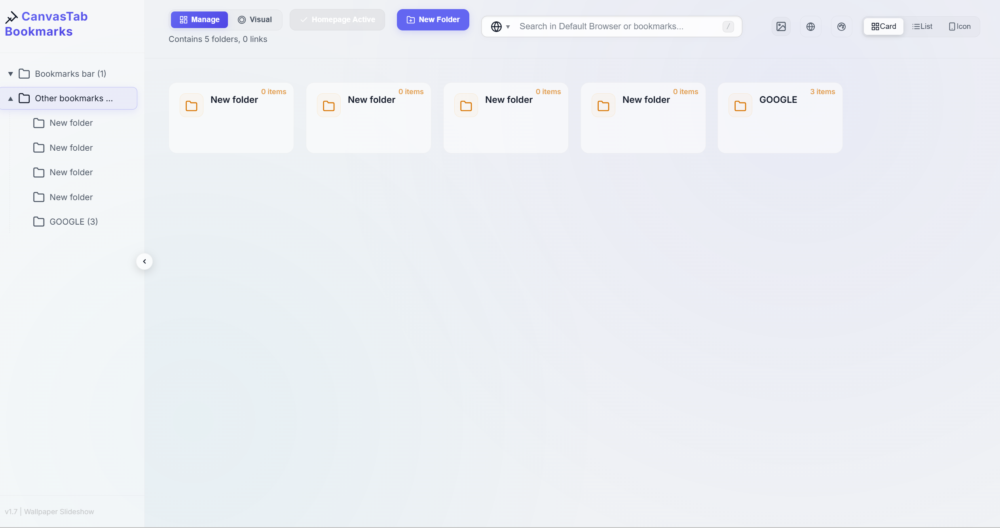
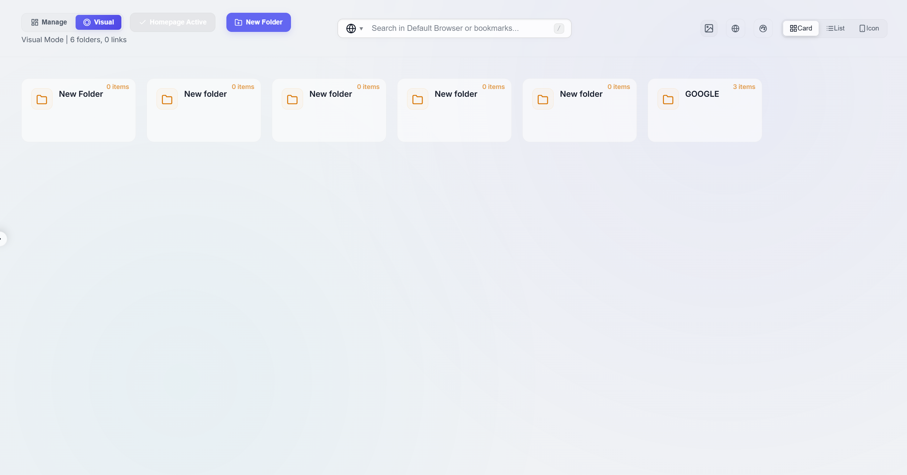
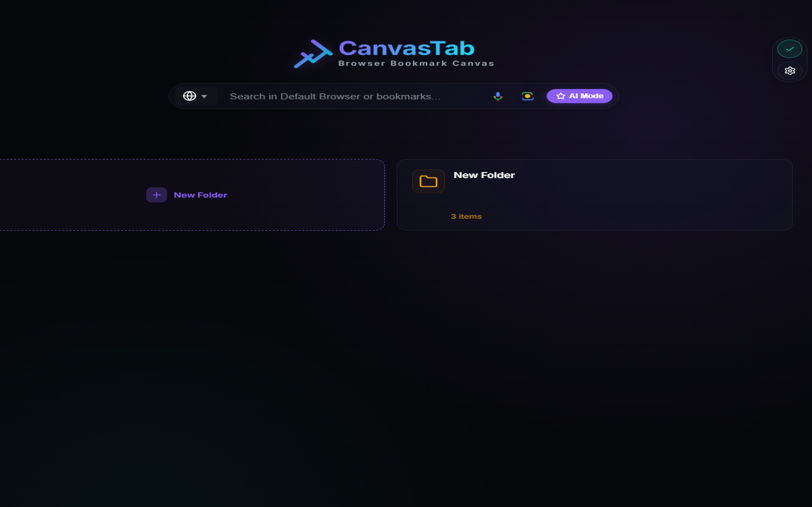
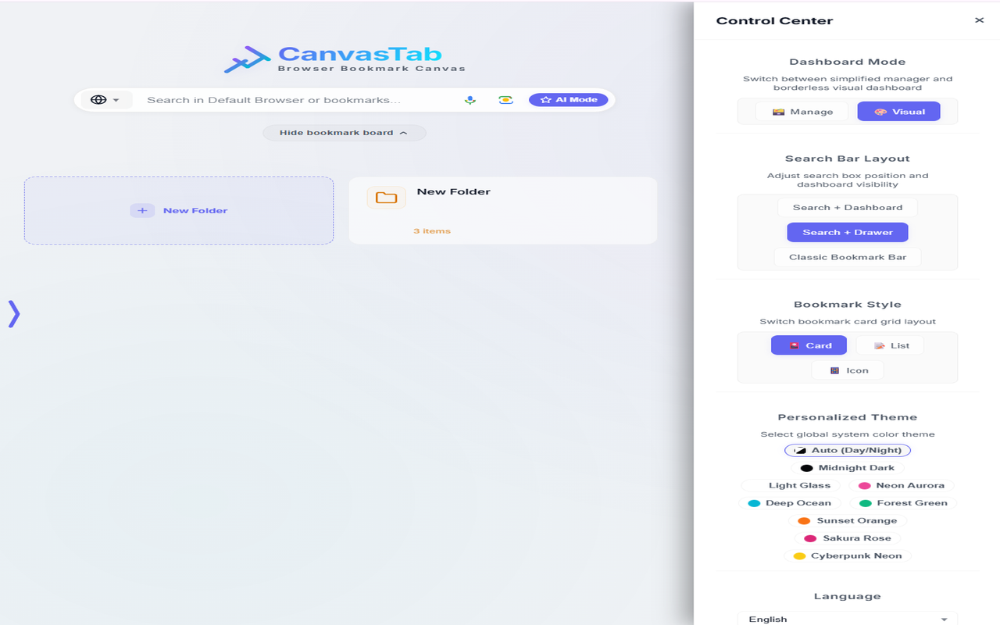
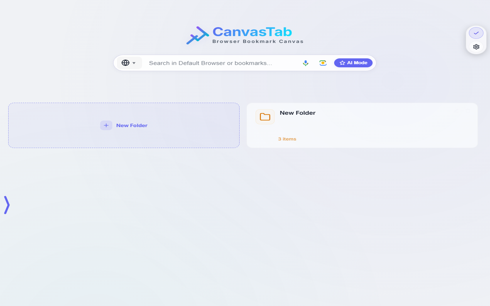
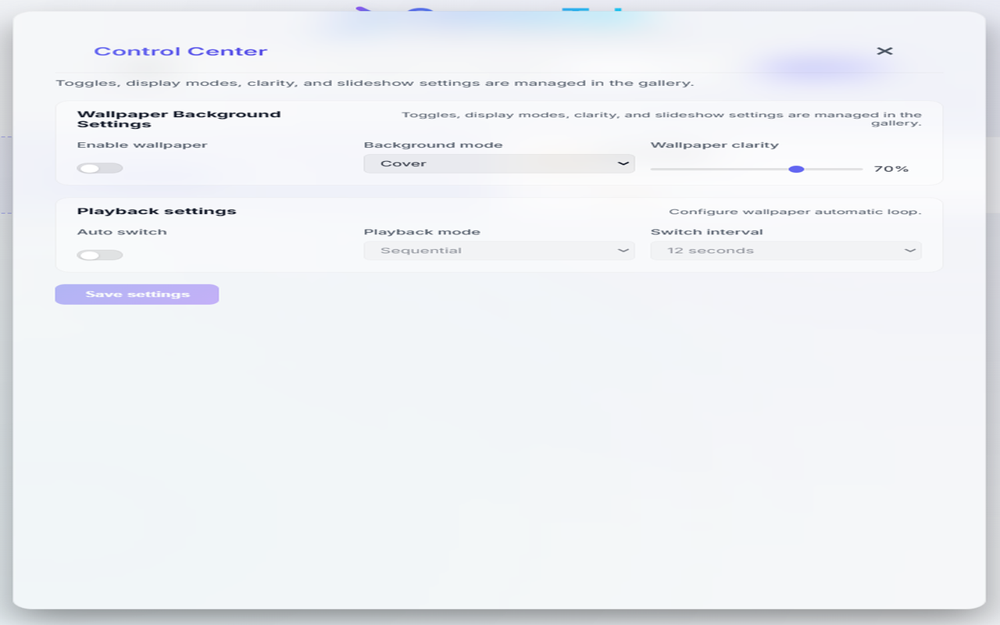

# CanvasTab: Wallpaper Canvas & Bookmark Organizer

  
   
  <strong>An aesthetic, minimal card-style browser bookmarks manager and customizable New Tab dashboard.</strong>
    
  
  
  

---

## ✨ Features

- **Card-style Visualization** — Browse bookmarks in card grid, list, or icon views
- **8 Premium Themes** — Midnight Dark, Frosted Silver, Neon Aurora, Deep Ocean, Forest Green, Sunset Orange, Sakura Rose, Cyberpunk Neon
  
  <table>
    <tr>
      <td align="center"><strong>Midnight Dark (Manage Mode)</strong></td>
      <td align="center"><strong>Frosted Silver (Manage Mode)</strong></td>
    </tr>
    <tr>
      <td></td>
      <td></td>
    </tr>
  </table>

- **Custom Wallpaper Canvas** — Upload up to 6 images with opacity control and slideshow mode
  
   
  
  

- **Multi-in-One Search** — Google, Bing, default browser search, and custom search engines
- **Folder Management** — Create, delete, and drag-and-drop folders across the sidebar tree and card grid
- **Multilingual** — English, Simplified Chinese, Traditional Chinese, Japanese, Korean, Spanish, French, German
- **100% Local & Private** — Zero data collection, everything stays in your browser

## 📸 Screenshots & Gallery

<table>
  <tr>
    <td align="center"><strong>Wallpaper Manager & Slideshow Controls</strong></td>
    <td align="center"><strong>Auto Day/Night Theme Mode</strong></td>
  </tr>
  <tr>
    <td></td>
    <td></td>
  </tr>
  <tr>
    <td align="center"><strong>Sidebar Context Menu & Folder Actions</strong></td>
    <td align="center"><strong>Multilingual Support (30 Languages)</strong></td>
  </tr>
  <tr>
    <td></td>
    <td></td>
  </tr>
</table>

## 🌐 Compatibility

Works on any Chromium-based browser including **Google Chrome** and **Microsoft Edge**.

## 🔒 Privacy

CanvasTab collects **zero user data**. See [PRIVACY.md](./PRIVACY.md) for full details.

## 📦 Installation

Install directly from the [Chrome Web Store](https://chromewebstore.google.com) *(link coming soon)*.

Or load unpacked for development:
1. Clone this repository
2. Go to `chrome://extensions`
3. Enable **Developer mode**
4. Click **Load unpacked** and select this folder

## 📄 License

MIT License © 2026 UIhoshi
